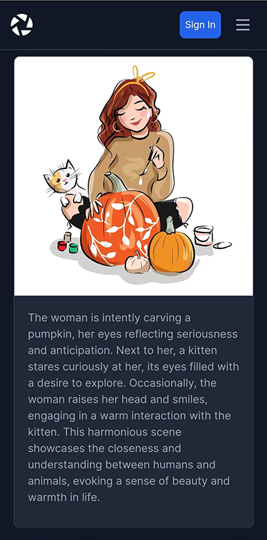

AI Image Description Generator
================

**[English](./README.md)** | **[中文](./README_zh.md)**

**AI Image Description Generator** accurately extracts the key elements from images and interprets the creative purposes behind them, which can be applied in fields such as scientific research, artistic creation, and the mutual search between images and texts.  

* It is based on **ERNIE 3.5** OR **GEMINI-PRO-1.5** API;
* It supports multi languages;
* Integrating the **clerk.com** User Management Platform;
* Real-time Data Processing: Supports streaming data transmission and utilizes the Shit-And algorithm to parse JSON data.
* Responsive Design: Adapts to desktops, tablets, mobile phones, and other devices.
* S3 storage support: Manage your data with S3 storage.
* Infinite Scrolling Card List SEO-Friendly: Provides an infinite scrolling card list designed for SEO.
* It supports dark mode theme;
* It use Next.js to build full-stack web applications.;

Screenshots & Demo
----------------





DEMO: [www.imagedescriptiongenerator.xyz](https://imagedescriptiongenerator.xyz/)

Getting Started
----------------

Step 1. Node.js 18.17 or later.  
  
Step 2. Run the development server

```sh
cd <project_path>
npm install
npm run dev
```

Step 3. Open browser, visit **<http://localhost:3000>**

Official site
----------------

* [www.imagedescriptiongenerator.xyz](https://imagedescriptiongenerator.xyz/)

Directory Structure
----------------

```text
root      // next.js project
├─ public   
├─ src
    ├─ app  //main page
    ├─ components     // next.js components
    ├─ dictionaries   // Add new language using the JSON file
    ├─ lib            // ernie and gemini api service 
```

Others
----------------

you can contact me at Twitter: [https://twitter.com/imgdesgen](https://twitter.com/imgdesgen)

if this project is helpful to you, buy be a coffee.

<a href='https://ko-fi.com/Q5Q1WDG36' target='_blank'></a>
